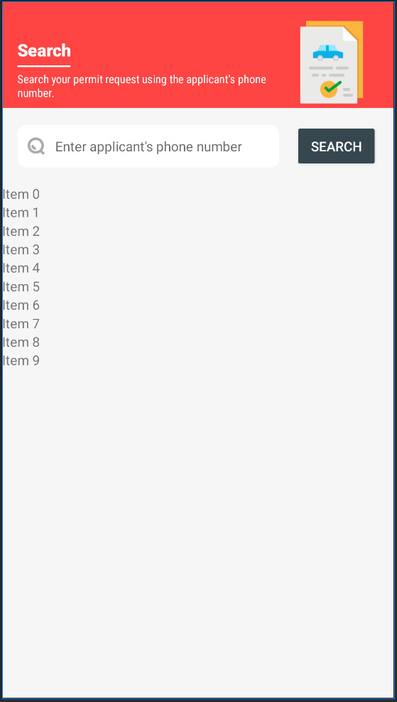

# 🚗 ePass - COVID-19 Travel Pass Application

<div align="center">


**A digital solution for travel pass applications during COVID-19 pandemic**

*Developed for the residents of Changlang District, Arunachal Pradesh*

[](#-project-status)

</div>

---

## 📱 About the Project

**ePass** is an Android application developed during the COVID-19 pandemic (2020) to facilitate digital travel pass applications for the residents of Changlang District, Arunachal Pradesh. The app streamlines the process of applying for travel permits during lockdown restrictions, making it easier for citizens to request and track their travel permissions.

### 🎯 Key Features

- **📋 Multi-Purpose Travel Passes**: Support for various types of travel passes including:
  - 🏥 Medical emergencies
  - 🛒 Essential goods transportation
  - 🍃 Tea and Areca nut transportation
  - 🏗️ Construction material transport
  - 👷 Labour and student movement
  - 🚌 Intra-Arunachal Pradesh travel

- **👤 User-Friendly Interface**: Step-by-step form filling process with intuitive navigation
- **🔍 Pass Search & Tracking**: Search existing applications using phone number
- **📱 QR Code Integration**: Digital passes with QR codes for verification
- **📄 Document Management**: Upload and manage required documents
- **🌐 Real-time Updates**: Live status updates for application approval

---

## 🏗️ Technical Architecture

### **Tech Stack**
- **Platform**: Android (Native)
- **Language**: Java
- **Architecture**: Multi-module Android project
- **Backend Integration**: RESTful API with Retrofit
- **Database**: Firebase Analytics
- **Image Processing**: Picasso for image loading and compression
- **UI Components**: Material Design with custom theming

### **Project Structure**
```
ePassBordumsa/
├── app/                    # Main application module
│   ├── src/main/java/     # Application source code
│   └── src/main/res/      # Resources (layouts, strings, etc.)
├── core/                   # Core module with shared components
│   ├── model/             # Data models
│   ├── api/               # API interfaces
│   └── utility/           # Utility classes
└── build.gradle           # Project configuration
```

### **Key Components**

#### **Core Models**
- `EPass`: Main pass entity with all travel details
- `Traveller`: Individual traveller information
- `ApplicantDetail`: Applicant personal information
- `DocumentDetail`: Document management

#### **Main Activities**
- `EFormActivity`: Multi-step form for pass application
- `SearchActivity`: Search and track existing applications
- `PermitDetailActivity`: View detailed pass information
- `ImageViewerActivity`: Document and image viewing

#### **Form Steps**
1. **Form Type Selection**: Choose the type of travel pass
2. **Applicant Details**: Personal information collection
3. **Traveller Information**: Add multiple travellers
4. **Journey Details**: Travel dates and routes
5. **Document Upload**: Required document submission
6. **Terms & Conditions**: Agreement and submission

---

## 🚀 Getting Started

### **Prerequisites**
- Android Studio 4.0+
- Android SDK 21+ (Android 5.0 Lollipop)
- Java 8+
- Firebase project setup

### **Installation**

1. **Clone the repository**
   ```bash
   git clone https://github.com/yourusername/ePassBordumsa.git
   cd ePassBordumsa
   ```

2. **Open in Android Studio**
   - Launch Android Studio
   - Select "Open an existing project"
   - Navigate to the cloned directory

3. **Configure Firebase**
   - Replace `google-services.json` with your Firebase configuration
   - Update Firebase project settings in the Firebase console

4. **Build and Run**
   ```bash
   ./gradlew assembleDebug
   ```

### **Dependencies**
The project uses several key libraries:
- **Retrofit 2.8.1**: Network communication
- **Picasso 2.71828**: Image loading and caching
- **Material Design Components**: Modern UI components
- **Firebase Analytics**: Usage tracking
- **Parceler**: Object serialization

---

## 📱 Screenshots

<div align="center">

### **Complete Application Flow**

| **Step 1: Form Type Selection** | **Step 2: Applicant Details** | **Step 3: Traveller Information** |
|:---:|:---:|:---:|
|  |  |  |
| *Choose travel pass type* | *Enter personal information* | *Add traveller details* |

| **Step 4: Journey Details** | **Step 5: Document Upload** | **Step 6: Terms & Conditions** |
|:---:|:---:|:---:|
|  |  |  |
| *Set travel dates and routes* | *Upload required documents* | *Accept terms and submit* |

### **Search & Tracking Features**

| **Pass Search Interface** | **Pass Details View** |
|:---:|:---:|
|  |  |
| *Search existing applications* | *View detailed pass information* |

</div>

### **Key Features Showcased**

- **📋 Multi-Step Form**: Complete 6-step application process with progress indicators
- **🎨 Color-Coded Categories**: Different themes for each pass type (Medical, Essential Goods, etc.)
- **📄 Document Management**: Upload multiple document types with validation
- **🔍 Search & Track**: Find and monitor existing applications
- **📱 Material Design**: Clean, modern interface with intuitive navigation
- **✅ Terms Acceptance**: Clear terms and conditions with checkbox acceptance
- **📤 Form Submission**: Final "SEND REQUEST" button to submit application

</div>

---

## 🎨 Design Features

### **Color-Coded Categories**
Each travel pass type has a unique color scheme:
- 🏥 **Medical**: Red theme
- 🛒 **Essential Goods**: Blue theme  
- 🍃 **Tea/Areca**: Green theme
- 🏗️ **Construction**: Orange theme
- 👷 **Labour/Student**: Purple theme
- 🚌 **Intra-Arunachal**: Teal theme

### **User Experience**
- **Step-by-step wizard**: Guided form completion
- **Data persistence**: Form data saved between steps
- **Validation**: Real-time input validation
- **Offline capability**: Basic functionality without internet
- **Responsive design**: Optimized for various screen sizes

---

## 🔧 Configuration

### **API Configuration**
Update the API endpoints in the `ApiManager` class:
```java
// Update base URL for your backend
public static final String BASE_URL = "https://your-api-endpoint.com/";
```

### **Firebase Setup**
1. Create a new Firebase project
2. Enable Analytics
3. Download `google-services.json`
4. Place it in the `app/` directory

### **Permissions**
The app requires the following permissions:
- `INTERNET`: API communication
- `CAMERA`: Document scanning
- `READ/WRITE_EXTERNAL_STORAGE`: File management
- `ACCESS_WIFI_STATE`: Network status

---

## 📊 Project Statistics

<div align="center">

| Metric | Value |
|:---:|:---:|
| **Total Files** | 50+ |
| **Java Classes** | 25+ |
| **XML Layouts** | 15+ |
| **API Endpoints** | 10+ |
| **Target SDK** | 29 (Android 10) |
| **Min SDK** | 21 (Android 5.0) |

</div>

---

## 🤝 Contributing

> **⚠️ Important Notice**: This project is **no longer maintained**. It was developed as a specific solution for COVID-19 travel restrictions in 2020.

While the project is not actively maintained, the codebase serves as a reference for:
- Android multi-step form implementation
- RESTful API integration patterns
- Material Design implementation
- Firebase integration examples

---

## 📄 License

This project is developed for educational and reference purposes. Please ensure compliance with local regulations and data protection laws when using or modifying this code.

---

## 👨‍💻 Developer

**Developed by**: Mainong Jenbum  
**Year**: 2020  
**Purpose**: COVID-19 Travel Pass Management  
**Location**: Changlang District, Arunachal Pradesh, India

---

## 🏥 Project Status

<div align="center">


**This project is no longer being maintained.**

*Developed during COVID-19 pandemic (2020) for travel pass management in Changlang District, Arunachal Pradesh. The application served its purpose during the pandemic and is now archived for reference.*

</div>

---

## 📞 Contact

For questions about this project or to discuss the implementation:

- **Email**: [mainong.jenbum@gmail.com]
- **GitHub**: [@mainong-jenbum]
- **LinkedIn**: [[Mainong Jenbum](https://www.linkedin.com/in/mainongjenbum/)]

---

<div align="center">

**Made with ❤️ for the people of Changlang District, Arunachal Pradesh**

*During the challenging times of COVID-19 pandemic*

</div>
